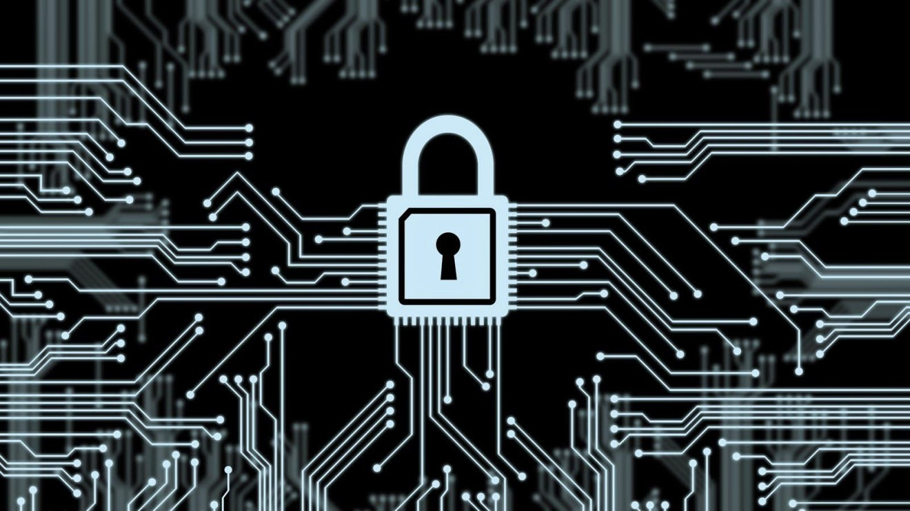
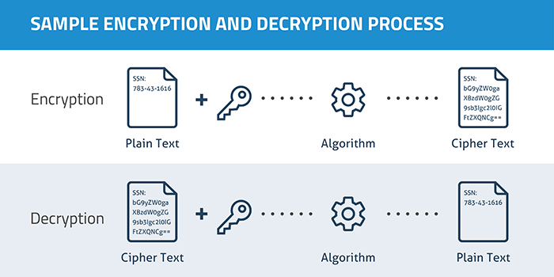
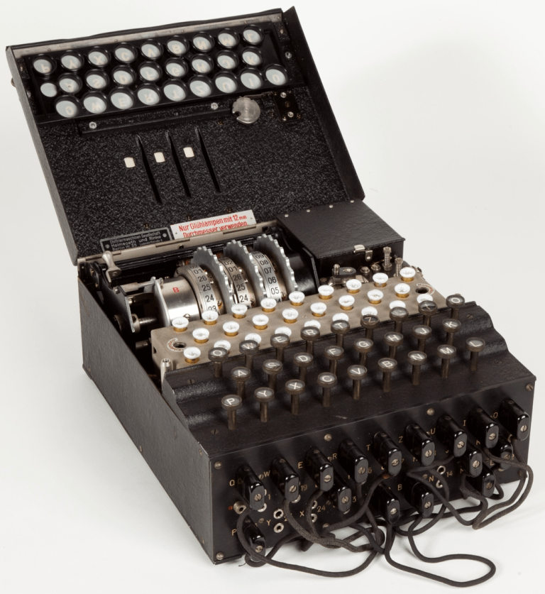
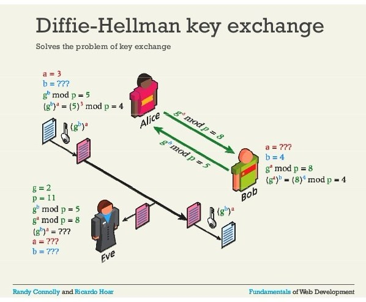
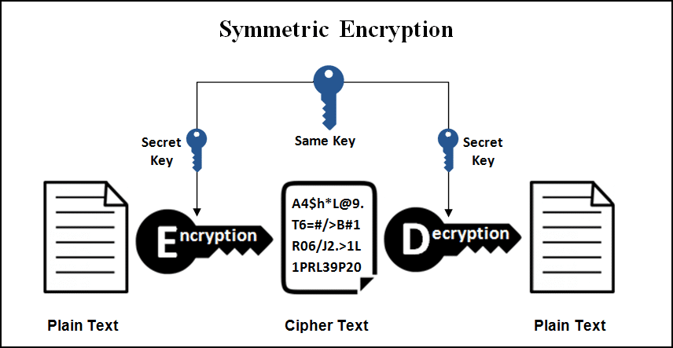
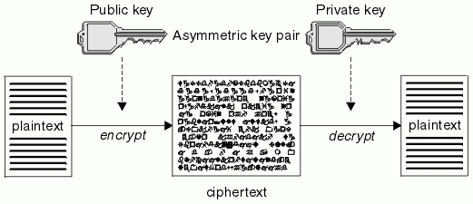
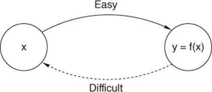
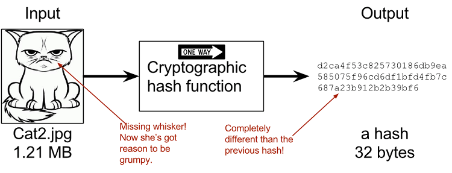

 

## Crypto (Greek, _Kruptós_)

### Concealed, private, hidden, secret

I. Cryptanalysis  
II. Key Exchange  
III. Data Encryption Standard  
IV. Symmetric Encryption  
V. Public Key Exchange  
VI. One Way Functions  
VII. Pretty Good Privacy  
VIII. Cryptoanarchy  
IX. Cryptoeconomics  

## Cryptography

The use of codes and cyphers for protecting secrets **Code**: A system of rules to **convert secret messages** into secure forms that can be broadcast over an **insecure channel** **Cypher**: An algorithm that **encrypts** or **decrypts** a message **Encryption**: A message that authorized parties can access and unauthorized parties cannot. It will not prevent interference of the transfer of the message; it simply denies the content to any interceptor.  

A message is encrypted with an algorithm called a **cyphertext**. It can only be read if decrypted with an **encryption key**. The **cyphertext** transforms the message into random digital gibberish and is returned to its original form by the **encryption key**.  

  

In principle it's possible to decrypt the message without the key, but it's very difficult in practice. There will be a finite number of possible answers which a computer could try to brute-force guess, one by one, until eventually arriving at the correct answer. But a well-designed encryption scheme has so many possible key values that guessing every possible answer with a computer would take millions of years, even with billions of calculations per second. This results in codes that are for all practical purposes unbreakable when correctly implemented (until **quantum computers** come around and ruin everything).  

**Caesar’s cypher** was a substitution cypher used by Julius Caesar to protect his military correspondence. Each letter in the message is substituted with the letter three spaces to the left in the alphabet (E turns into a B). In this case the key is the instruction to shift to the right by three.  

## I. Cryptanalysis

Breaking codes and cyphers to expose secrets.  

### Enigma Machine

A series of electro-mechanical **rotor cypher machines** developed and used in the early- to mid-20th century to encrypt commercial, diplomatic and military communication.  

  

Several different Enigma models were produced, but the **Nazi Wehrmacht** models were the most complex due to the addition of a plugboard. Its wikipedia page is over **[10,000 words](https://en.wikipedia.org/wiki/Enigma_machine)** long.  

  

## Bombe

An electro-mechanical device used by British cryptographers to decypher German secret messages encrypted by Enigma machines.  

The first bombe was produced in 1939 at the **Government Code and Cypher School** at **Bletchley Park** by **Alan Turing**. The bombe was designed to discover some of the daily settings of the Enigma machines on the various German military networks.  

  

To decrypt the messages they needed to discover the set of rotors in use and their positions in the machine, which included two parts:  

* The rotor core start positions for the message (the decryption key)
* One of the wirings of the plugboard

### Classic Cryptography

Encryption with calculations on pen and paper or mechanical aids. This culminated with the Enigma rotor machines and the Bombe.  

### Modern Cryptography

Succeeding WWII, encryption with electronic, programmable computers created complex codes that cost more money to decrypt. This gave more power to agents that utilized strong encryption techniques.  

## II. Key Exchange

**Two keys** that are mathematically connected. This allows two individuals to communicate **securely** through an **insecure** channel as long as they are both in possession of their **keys**.  

  

Alice broadcasts an **encrypted message** to Bob. It is broadcast over a **channel** that Eve can listen to without Alice or Bob’s control. If Eve intercepts the message it will contain random gibberish. The gibberish can be transformed back into the message by Bob with an algorithm (**cyphertext**) that only Alice and Bob have access to.

This allows us to construct a (very, very) basic description of the mechanism of bitcoin. **Bitcoin** is the encrypted message that Alice wants to send to Bob. We need to broadcast bitcoin through the **Internet** (the least secure channel in human history). A **bitcoin wallet** is the cyphertext that allows Bob to receive the money and verify it while also keeping the money secure from all adversaries

However we must be careful not to take this simplification too literally. There are many significantly more complicated cryptographic innovations that lead to Bitcoin's creation in its current form. This does not include any description of a **shared ledger**, but lets not try to run before we can walk. Nonetheless, this metaphor still gives us a mental model for conceptualizing the process of buying, storing, and transferring bitcoins between two individuals.  

Cryptographers framed the pursuit of secrecy in two different models:  

### Perfect secrecy

Systems made to protect against attackers with **infinite resources** to decode a message

### Practical secrecy

Systems made to protect against attackers with **finite resources** with which to decode a message

Practical secrecy was an essential consideration when our computers were working with kilobytes of data. But to make a cypher on the World Wide Web **unbreakable** it must have perfect secrecy, since it must be secure from everyone on the planet.

## III. Data Encryption Standard

In 1975 a research group at IBM was invited by the National Bureau of Standards to publish the **DES** in the U.S. Federal Register. The Bureau hoped IBM could develop secure electronic communication facilities for banks and other large financial organizations. In 1977 the NSA provided some notes for the standard behind the scenes and a revised version of the same paper became the first publicly accessible government grade cypher. The release of its specification created an explosion of public and academic interest in cryptography.  

In the 1990s commercial transactions over the Internet needed a new, robust, and widespread standard for encryption. In the late 1990s and early 2000s public-key algorithms became a more common approach. The creation of a new protocol known as the **Secure Socket Layer** (SSL) allowed Internet users to purchase goods, pay bills, and conduct traditional banking transactions.  

The aging DES was officially replaced by the **Advanced Encryption Standard** (AES) in 2001, which is still in use today. AES has been incorporated into many national and organizational standards, but there is a problem. 56-bit **key size** is insufficient to guard against **brute force attacks** (the **Electronic Frontier Foundation** cracked the encryption in 1997 in 56 hours). Using an unaltered DES encryption is insecure for use in new designs. In fact, all messages sent since 1976 using DES are vulnerable to decryption.

## IV. Symmetric Encryption

The DES and other encryption techniques at the time were **symmetric-key algorithms**, meaning the same key is used by both the sender and the recipient. They must both keep the key secret. Like the Enigma machine, the key for a code is the **codebook** which must be **distributed and kept secret**. The key had to be exchanged between Alice and Bob through a secure channel prior to any interaction through an unsecure channel.

This type of exchange becomes unmanageable in the real world with large groups of people who are unable to communicate over a secure channel. A separate key was needed for every pair of users wishing to communicate securely, known as the **key exchange problem**. In 1976 Whitfield Diffie and Martin Hellman implemented a new method for distributing cryptographic keys that was originally conceived by Ralph Merkel, known as the **Diffie–Hellman key exchange**.

## V. Public Key Exchange

Any cryptographic system that uses pairs of keys, **public keys**which may be disseminated widely, and **private keys** which are known only to the owner. An algorithm of this kind is known as an **asymmetric key algorithm**. Using such an algorithm, only one key pair is needed per user. By designating one key as private (always secret) and the other as public (often widely available), no secure channel is needed for key exchange.

Some (though not all) of these algorithms have the characteristic that one of the paired keys can't be deduced from the other through any known method except for simple trial and error. Asymmetric keys with a sufficient **key size** enable 100% secure communication, but only in theory.

The catch is it only works if the private key stays secret. If Alice and Bob memorize their keys and never share them with a single soul they will be able to communicate securely for the rest of their lives. The public key can even be widely available, yet they will only ever need their individual private keys (again, only until **Peter Shor** jumps out and **[cryptopunches](https://www.wired.com/1998/03/aussies-out-to-give-mozilla-crypto-punch/)** the **[factorization](https://en.wikipedia.org/wiki/Integer_factorization)** right out of them).

Alice and Bob can communicate securely over an insecure channel when both of them know each other’s private keys as well as the public key. Imagine Alice and Bob each have a pair of keys they've been using for years with many other users. At the start of their message, they exchange public keys that are unencrypted over an insecure line. Alice encrypts a message with their private key, and again with Bob's public key. The twice-encrypted message is then sent as a digital file to Bob. Bob receives the file and first decrypts it with his private key, and then again with Alice’s public key.

If this sequence results in a coherent message Bob assumes the message came from Alice (or someone in possession of Alice’s private key). Anyone eavesdropping on the channel will need Bob's private key in order to understand the message.

## VI. One Way Functions

A math problem that is very simple to execute one way, but requires vast amounts of computational power to do in reverse. The archetypal one way function is **RSA**, invented in 1977. RSA multiples two large prime numbers and spits out a new number.

A computer could quickly and easily multiple 2^77232917 and 2^74207281. But if you were to take the resulting answer with its 23,249,425 digits, and fed it into a different computer asking it to figure out what those first two prime numbers were, it would have to guess every possible combination of primes up to that number.

Computers perform operations very, very quickly. But the number of possible answers is so unbelievably large it would take millions of years for computers to find the right answer. It's easy to multiply two large primes and check for the correct answer. But it's very difficult to find the factors of the product of two large primes, and with large enough numbers it is for all practical purposes impossible.

Asymmetric algorithms require very long keys to be to reach the same **level of security** provided by relatively shorter symmetric keys. The need to both generate the key pairs, and perform the encryption/decryption operations make asymmetric algorithms computationally expensive. Since symmetric algorithms can often use any sequence of (random, or at least unpredictable) bits as a key, a disposable session key can be quickly generated for short-term use.

### Hash Function

Encodes information quickly using typical algorithms, and can be used reduce large bits of data into data of a fixed size. A **cryptographic hash function** transforms a large string of text (**key**) into a different, smaller string of text (**hash value**). This creates a "digital fingerprint" of the message, and that specific hash value must be used to identify that specific message. This allows hash functions to verify **digital signatures**.

Much like a hand-written signature, these signatures are verified by assigning their exact hash code to a person. Modern operating systems and many web applications store passwords this way. A user on the system creates a password that is first hashed by using a key and then stored in a password file (for the love of god **salt your hashes**). This allows all of us to store various encrypted messages.

## VII. Pretty Good Privacy

In 1991 Phil Zimmermann distributed a freeware version of **Pretty Good Privacy** (PGP), a very high quality crypto system. It helped set the standard for open source security software like **OpenPGP**.

He distributed a freeware version of PGP when he felt threatened by legislation then under consideration by the US Government that would require **backdoors** to be included in all cryptographic products developed within the US. His system was released worldwide shortly after he released it in the US, and that began a long criminal investigation by the US Government Justice Department for the alleged violation of export restrictions. The Justice Department eventually dropped its case against Zimmermann, and the freeware distribution of PGP has continued around the world.

For the first time individuals gained access to public, standardized cryptographic protocols that previously only governments could attain. Citizens could use a communication system that was not easily breakable, even by heavily funded government agencies. This has already lead to [profound changes](https://cryptome.org/2016/05/2016-5-6-Statement-by-John-Doe.pdf) in the [organization of information](https://en.wikipedia.org/wiki/Global_surveillance_disclosures_(2013%E2%80%93present)) in our [global society](https://www.icij.org/investigations/paradise-papers/).

PGP and similar cryptographic systems remain unbreakable to this day, leaving hackers to exploit other weaknesses including:

* Poor implementation
* Human error
* Insistence on symmetric key systems (so as to make sure the government has a copy)
* An overwhelming preference for convenience over security

These reoccurring patterns have lead to widespread systemic failures including:

* The first Wi-Fi encryption scheme **WEP**
* Content Scrambling System used for encrypting and controlling DVD use **A5/1** and **A5/2** cyphers used in GSM cell phones
* CRYPTO1 cypher used in the widely deployed **[MIFARE](https://en.wikipedia.org/wiki/MIFARE)**
* Classic **[smart cards](https://en.wikipedia.org/wiki/Smart_card)**

## VIII. Cryptoanarchy

Cryptographic software used by citizens wishing to evade political prosecution and censorship, while also enabling secure, anonymous transactions over computer networks to attain greater privacy and political freedom. In 1992 a group of like minded computer scientists started exchanging emails about widely available cryptographic technology and it’s potential influence on society. They believed the security these tools facilitated would result in greater privacy and political freedom for individuals. Readers of the mailing list would be referred to as **[cypherpunks](https://en.wikipedia.org/wiki/Cypherpunk)**.  

> A specter is haunting the modern world, the specter of crypto anarchy. Computer technology is on the verge of providing the ability for individuals and groups to communicate and interact with each other in a totally anonymous manner. Interactions over networks will be untraceable, via extensive rerouting of encrypted packets and tamper-proof boxes which implement cryptographic protocols with nearly perfect assurance against any tampering._ _These developments will alter completely the nature of government regulation, the ability to tax and control economic interactions, the ability to keep information secret, and will even alter the nature of trust and reputation. The State will of course try to slow or halt the spread of this technology, citing national security concerns, use of the technology by drug dealers and tax evaders, and fears of societal disintegration._ _Many of these concerns will be valid; crypto anarchy will allow national secrets to be traded freely and will allow illicit and stolen materials to be traded. But this will not halt the spread of crypto anarchy. Just as the technology of print altered and reduced the power of medieval guilds and the social power structure, so too will cryptologic methods fundamentally alter the nature of corporations and of government interference in economic transactions.  
> -Tim May, **[The Crypto Anarchist Manifesto](https://www.activism.net/cypherpunk/crypto-anarchy.html)** (1992)

> Privacy is necessary for an open society in the electronic age. Privacy is not secrecy. A private matter is something one doesn't want the whole world to know, but a secret matter is something one doesn't want anybody to know. Privacy is the power to selectively reveal oneself to the world.  
> -Eric Hughes, **[A Cypherpunk's Manifesto](https://www.activism.net/cypherpunk/manifesto.html)** (1993)

In a 1994 cypherpunks email titled “**[The Cyphernomicon](https://www.cypherpunks.to/faq/cyphernomicron/cyphernomicon.html)**,” Tim May summarized what he saw as “The Basic Issues” discussed over the first two years of the mailing list. These issues centered on the inherent tension in a free society between the right to privacy and the need to uphold the rule of law. He argued that cryptographic technology would reify these issues in a way never seen before.

> **The Great Divide: Privacy vs. compliance with laws**
> * Free speech and privacy, even if means some criminals cannot be caught (a stand the U.S. Constitution was strongly in favor of, at one time)
> * A man's home is his castle (the essence of the Magna Carta systems)
> * Rights of the individual are secure from random searches and other invasive tactics to catch criminals, regulate behavior, and control the population
> * Self-protection vs. protection by law and police
> * We are already past the point of no return.
> * Strong cryptography as building material for a new age
> * Transnationalism and increased degrees of freedom leads to borders becoming largely symbolic as governments lose control over movements and communications of citizens.

### Cypherpunk

An activist advocating use of strong cryptography and privacy-enhancing technologies as an enabler of greater social cooperation and political change. The mailing list's discussion of cryptography as an explicitly political tool would have a powerful influence on computer scientists and political libertarians alike. One of members of the mailing list would go on to create **[WikiLeaks](https://en.wikipedia.org/wiki/Cypherpunk#Noteworthy_cypherpunks)**. Another would create **[Bitcoin](https://www.gwern.net/Bitcoin-is-Worse-is-Better)**.  

### Cryptocurrency/Cryptoasset

Digital asset designed to work as a medium of exchange by using cryptography to verify transactions, control the creation of additional units, and facilitate the transfer of assets without the oversight of a centralized authority.  

## IX. Cryptoeconomics

Cryptographic algorithms, network protocols, and game theoretic strategies combined to create a secure, decentralized market with no central authority. A set of protocols that govern production, distribution, and consumption of goods and services in a secure, decentralized digital market. Every user of the currency benefits from mainstream adoption, incentivizing positive human cooperation and synergistic value creation through network effects. This engenders a stronger sense of autonomy and independence throughout the users' lives and society. Game theory entails the study of economic interactions between agents in various adversarial and cooperative environments.  

In 2011 **Silk Road** became the world’s first significant **cryptomarket**. It provided an anonymous (sort-of) and secure (whoops) platform to purchase illegal drugs and other contraband in exchange for bitcoins. This simultaneously confirmed the best and worst predictions of the possible effects cryptocurrency would have on the world.  

# Epilogue

I have yet to meet a person who understood bitcoin the first time it was explained to them. Only the most dedicated of autodidacts seem to grok bitcoin. It took me years of wrestling with these terms and ideas before they started to coalesce in my head into a coherent and usable body of knowledge. With an understanding of the fundamental issues at the heart of cryptography's progression from hand computed cyphers into a global decentralized cryptoeconomy we have all the knowledge necessary to appreciate the true utility and innovation of the **blockchain**.